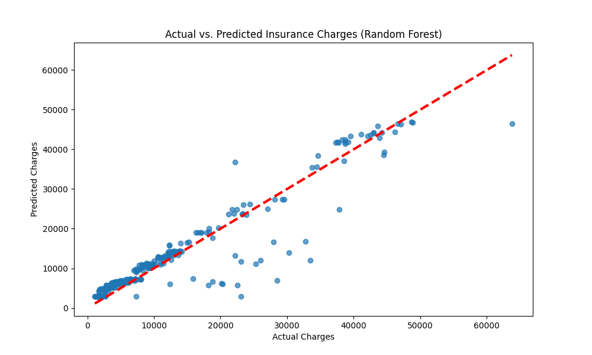
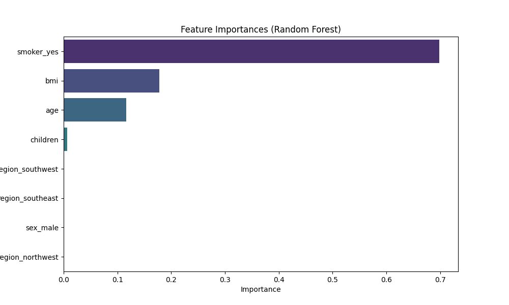

# Insurance_prediction
Insurance prediction, Random Forest Regression, Algorithm


# Insurance Charge Prediction using Random Forest

This project predicts medical insurance charges based on various a_test_trit_testingutes of individuals. It utilizes a Random Forest Regressor model, with hyperparameter tuning performed using GridSearchCV, to achieve accurate predictions.

## Table of Contents
1.  [Project Overview](#project-overview)
2.  [Dataset](#dataset)
3.  [Features of the Script](#features-of-the-script)
4.  [Technologies Used](#technologies-used)
5.  [Setup and Installation](#setup-and-installation)
6.  [Usage](#usage)
7.  [Methodology](#methodology)
8.  [Results and Evaluation](#results-and-evaluation)
9.  [Visualizations](#visualizations)
10. [File Structure](#file-structure)
11. [Future Improvements](#future-improvements)
12. [License](#license)

## Project Overview
The goal of this project is to build a machine learning model that can predict insurance charges. This is a regression task, and a Random Forest Regressor is employed due to its robustness and ability to handle non-linear relationships. The script includes data preprocessing, model training, hyperparameter optimization, evaluation, and visualization of results and feature importances.

A specific analysis is also performed to compare the average medical charges between smokers and non-smokers.

## Dataset
The dataset used is `insurance.csv`, which typically contains the following columns:
*   `age`: Age of the primary beneficiary.
*   `sex`: Gender of the primary beneficiary (male/female).
*   `bmi`: Body mass index.
*   `children`: Number of children covered by health insurance / Number of dependents.
*   `smoker`: Whether the person smokes (yes/no).
*   `region`: The beneficiary's residential area in the US (e.g., northeast, southeast, southwest, northwest).
*   `charges`: Individual medical costs billed by health insurance (target variable).

**(Note: You might want to add a link to where you obtained the dataset, e.g., Kaggle, if it's publicly available.)**

## Features of the Script
*   Loads the insurance dataset.
*   Performs one-hot encoding for categorical features (`sex`, `smoker`, `region`).
*   Splits data into training and testing sets.
*   Applies `StandardScaler` to numerical features (`age`, `bmi`, `children`).
*   Trains a Random Forest Regressor model.
*   Utilizes `GridSearchCV` for hyperparameter tuning of the Random Forest model (n_estimators, max_depth, min_samples_split, min_samples_leaf).
*   Evaluates the model using Mean Squared Error (MSE) and R-squared (R²) score.
*   Visualizes:
    *   Actual vs. Predicted charges.
    *   Feature importances from the Random Forest model.
    *   Average medical charges by smoking status.
*   Calculates and prints the percentage difference in average charges between smokers and non-smokers.
*   Uses `matplotlib.use('Agg')` for generating plots in non-GUI environments (e.g., servers).

## Technologies Used
*   Python 3.x
*   pandas
*   numpy
*   scikit-learn
*   matplotlib
*   seaborn

## Setup and Installation

1.  **Clone the repository (or download the files):**
    ```bash
    git clone <your-repository-url>
    cd <your-repository-name>
    ```

2.  **Create a virtual environment (recommended):**
    ```bash
    python -m venv venv
    source venv/bin/activate  # On Windows: venv\Scripts\activate
    ```

3.  **Install dependencies:**
    Create a `requirements.txt` file with the following content:
    ```txt
    pandas
    numpy
    scikit-learn
    matplotlib
    seaborn
    ```
    Then install them:
    ```bash
    pip install -r requirements.txt
    ```

4.  **Dataset:**
    Ensure the `insurance.csv` file is present. The script currently expects it at `D:/University-Prj/ML0/insurance.csv`. You will need to:
    *   Place the `insurance.csv` file in that exact path, OR
    *   Modify the `file_path` variable in `Insurance_prediction.py` to point to the correct location of your `insurance.csv` file (e.g., place it in the same directory as the script and change `file_path = "insurance.csv"`).

## Usage
Once the setup is complete and the `insurance.csv` file path is correctly configured in the script:

1.  Navigate to the project directory in your terminal.
2.  Run the script:
    ```bash
    python Insurance_prediction.py
    ```
The script will:
*   Print basic dataset information and null value counts.
*   Print the best hyperparameters found by GridSearchCV.
*   Print the Mean Squared Error and R-squared score.
*   Print the feature importances.
*   Print the percentage difference in charges between smokers and non-smokers.
*   Save three plots:
    *   `rf_predictions_vs_actual.png`
    *   `rf_feature_importances.png`
    *   `smoker_vs_charges_barplot.png`

## Methodology

1.  **Data Loading & Initial Exploration:** The `insurance.csv` dataset is loaded into a pandas DataFrame. Basic information (`.head()`, `.info()`, `.isnull().sum()`) is displayed.
2.  **Preprocessing:**
    *   **One-Hot Encoding:** Categorical features (`sex`, `smoker`, `region`) are converted into numerical format using `pd.get_dummies()`. `drop_first=True` is used to avoid multicollinearity.
    *   **Train-Test Split:** The data is split into 80% training and 20% testing sets.
    *   **Feature Scaling:** Numerical features (`age`, `bmi`, `children`) are scaled using `StandardScaler` to ensure they have zero mean and unit variance. This helps the model converge faster and perform better, especially when features have different ranges.
3.  **Model Training & Hyperparameter Tuning:**
    *   A `RandomForestRegressor` is chosen as the predictive model.
    *   `GridSearchCV` is used to find the optimal combination of hyperparameters (`n_estimators`, `max_depth`, `min_samples_split`, `min_samples_leaf`) for the Random Forest model. It uses 3-fold cross-validation and `neg_mean_squared_error` as the scoring metric.
4.  **Prediction & Evaluation:**
    *   The best model from `GridSearchCV` is used to make predictions on the test set.
    *   The model's performance is evaluated using:
        *   **Mean Squared Error (MSE):** The average squared difference between the actual and predicted values.
        *   **R-squared (R²):** The proportion of the variance in the dependent variable that is predictable from the independent variables.
5.  **Analysis & Visualization:**
    *   A scatter plot compares actual vs. predicted charges.
    *   A bar plot shows the importance of each feature in the model's predictions.
    *   A bar plot compares the average charges for smokers vs. non-smokers, along with a calculation of the percentage difference.

## Results and Evaluation
The script will output the following metrics for the Random Forest model on the test set:
*   **Best Parameters:** (e.g., `{'max_depth': 6, 'min_samples_leaf': 3, 'min_samples_split': 6, 'n_estimators': 100}`)
*   **Mean Squared Error (MSE):** (e.g., `20123456.78`)
*   **R-squared (R²):** (e.g., `0.86`)

*(You should replace the example values above with the actual values you get when you run the script).*

The feature importances will also be printed, highlighting which factors most influence the prediction of insurance charges. The analysis of smoker vs. non-smoker charges will quantify the financial impact of smoking on medical costs.

## Visualizations
The script generates and saves the following plots:

1.  **`rf_predictions_vs_actual.png`**:
    *   A scatter plot showing the relationship between the actual insurance charges (x-axis) and the charges predicted by the model (y-axis). A diagonal red dashed line represents a perfect prediction.
    ```
    # (Optional: You can embed the image here if your GitHub supports it)
    # 
    ```

2.  **`rf_feature_importances.png`**:
    *   A bar plot displaying the importance of each feature as determined by the Random Forest model. Features are ranked from most to least important.
    ```
    # 
    ```

3.  **`smoker_vs_charges_barplot.png`**:
    *   A bar plot comparing the average medical charges for smokers versus non-smokers, with standard deviation indicated.
    ```
    # 
    ```

## File Structure
